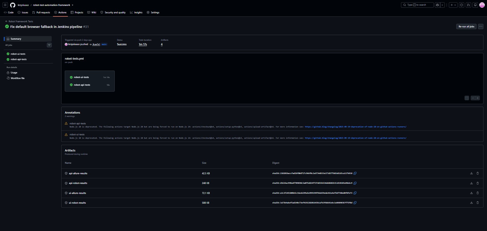
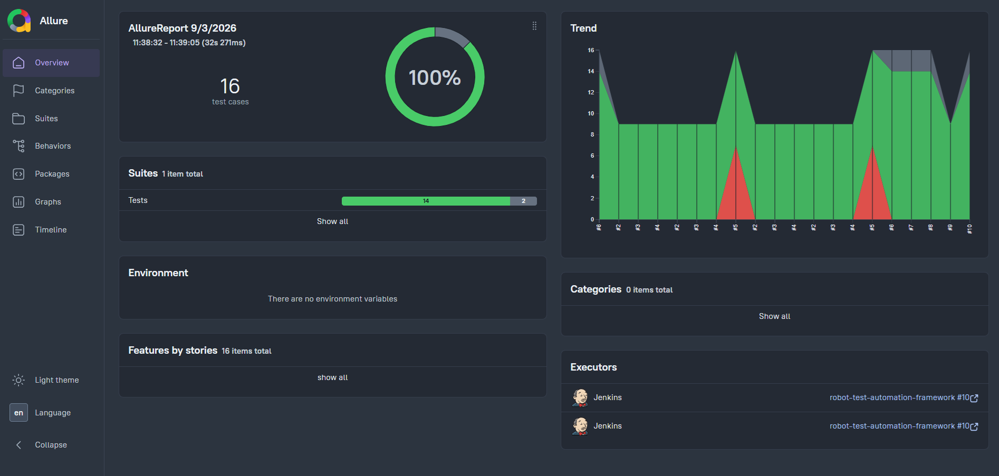

# Robot Framework Test Automation Framework


Automated test framework created with Robot Framework, SeleniumLibrary and RequestsLibrary.

The project contains both UI and API automated tests and demonstrates a maintainable automation architecture based on Page Object Pattern, reusable resources, centralized configuration and CI/CD integration.

The framework supports local and remote browser execution, cross-browser testing, Docker, Selenium Grid, Jenkins, GitHub Actions, Pabot and Allure reporting.

The project follows the same overall concepts as my Python Test Automation Framework while using Robot Framework best practices.

## Technologies

- Robot Framework
- SeleniumLibrary
- Selenium WebDriver
- RequestsLibrary
- JSONLibrary
- JSON Schema Validation
- Page Object Pattern
- Pabot
- Allure Reports
- Docker
- Docker Compose
- Selenium Grid
- Jenkins
- GitHub Actions
- Python
- RetryFailed listener

## Features

- Page Object Pattern architecture
- Reusable Element Actions layer
- Centralized configuration
- Centralized logging
- UI and API automated tests
- Dynamic test data generation
- Dynamic date generation
- Externalized test data
- Reusable Robot Framework resources
- Centralized browser management
- Chrome, Firefox and Edge support
- Local browser execution
- Remote WebDriver execution
- Selenium Grid support
- REST API automation
- Reusable API keywords
- GET, POST, PUT and DELETE operations
- JSON response validation
- JSON Schema validation
- Response time validation
- Parallel execution with Pabot
- Headless execution
- Retry mechanism
- Screenshot capture on UI failure
- Allure reporting
- Dockerized test execution
- Jenkins CI pipeline
- Parameterized Jenkins builds
- Automatic Jenkins builds using SCM polling
- GitHub Actions CI
- Robot Framework artifact archiving in Jenkins
- Helper scripts for local and remote execution

## Architecture

The framework separates UI automation, API automation and CI/CD execution into independent layers.

### UI execution flow

```text
Test
  ↓
Page Object
  ↓
Element Actions
  ↓
SeleniumLibrary
  ↓
WebDriver
  ↓
Local Browser / Selenium Grid
```

### API execution flow

```text
Test
  ↓
API Keywords
  ↓
RequestsLibrary
  ↓
HTTP Request
  ↓
REST API
```

## Project Structure

```text
robot-test-automation-framework/
│
├── .github/
│   └── workflows/
│       └── robot-tests.yml
│
├── api_tests/
│   ├── data/
│   ├── resources/
│   ├── schemas/
│   └── tests/
│
├── core/
│   └── config.robot
│
├── page_object_pattern/
│   ├── data/
│   ├── pages/
│   ├── resources/
│   └── tests/
│
├── results/
├── screenshots/
│   ├── github-actions.png
│   └── allure-report.png
├── scripts/
│   ├── start_grid.bat
│   ├── stop_grid.bat
│   ├── run_all_browsers.bat
│   └── run_all_browsers_remote.bat
│
├── Dockerfile
├── Dockerfile.jenkins
├── docker-compose.yml
├── docker-compose-grid.yml
├── docker-compose-jenkins.yml
├── Jenkinsfile
├── requirements.txt
├── README.md
└── .gitignore
```

## Installation

Clone the repository:

```bash
git clone https://github.com/krzysiuuus/robot-test-automation-framework.git
cd robot-test-automation-framework
```

Create virtual environment:

```bash
python -m venv venv
```

Activate it on Windows:

```bash
venv\Scripts\activate
```

Install dependencies:

```bash
pip install -r requirements.txt
```

## Running Tests

### Run UI tests locally

Chrome:

```bash
robot -d results -v BROWSER:Chrome page_object_pattern/tests
```

Firefox:

```bash
robot -d results -v BROWSER:Firefox page_object_pattern/tests
```

Edge:

```bash
robot -d results -v BROWSER:Edge page_object_pattern/tests
```

Local execution uses `EXECUTION=LOCAL` by default.

### Run selected UI test

Example:

```bash
robot -d results page_object_pattern/tests/test_flight_search.robot
```

### Run tests in headless mode

```bash
robot -d results \
-v BROWSER:Chrome \
-v HEADLESS:True \
page_object_pattern/tests
```

### Run tests with retry

The framework uses the `RetryFailed` listener.

Example:

```bash
robot -d results \
--listener RetryFailed:1 \
page_object_pattern/tests
```

### Run tests with Allure

```bash
robot -d results \
--listener allure_robotframework:results/allure \
page_object_pattern/tests
```

### Run tests with Allure and retry

```bash
robot -d results \
--listener RetryFailed:1 \
--listener allure_robotframework:results/allure \
-v BROWSER:Chrome \
page_object_pattern/tests
```

## Selenium Grid

The framework supports remote cross-browser UI execution using Selenium Grid.

The Grid contains:

```text
Selenium Hub
├── Chrome
├── Firefox
└── Edge
```

Start Selenium Grid:

```bash
docker compose -f docker-compose-grid.yml up -d
```

Grid UI: `http://localhost:4444/ui`

Grid status: `http://localhost:4444/status`

### Run UI tests through Selenium Grid

Chrome:

```bash
robot -d results \
-v EXECUTION:REMOTE \
-v BROWSER:Chrome \
page_object_pattern/tests
```

Firefox:

```bash
robot -d results \
-v EXECUTION:REMOTE \
-v BROWSER:Firefox \
page_object_pattern/tests
```

Edge:

```bash
robot -d results \
-v EXECUTION:REMOTE \
-v BROWSER:Edge \
page_object_pattern/tests
```

Stop Grid:

```bash
docker compose -f docker-compose-grid.yml down
```

## Browser Management

Browser management is centralized in:

`page_object_pattern/resources/browser.robot`

Supported browsers:

- Chrome
- Firefox
- Edge

Supported execution modes:

```text
LOCAL
REMOTE
```

The execution type is controlled through:

`EXECUTION`

Remote Grid URL is controlled through:

`REMOTE_URL`

Default remote URL:

`http://localhost:4444/wd/hub`

In Docker/Jenkins execution the framework uses:

`http://host.docker.internal:4444/wd/hub`

Headless execution is controlled through:

`HEADLESS`

## Parallel Execution

The framework supports parallel execution with Pabot.

Run UI tests in parallel:

```bash
pabot --outputdir results/pabot page_object_pattern/tests
```

Run UI tests in parallel through Selenium Grid:

```bash
pabot --processes 3 \
--outputdir results/pabot-grid \
-v EXECUTION:REMOTE \
-v BROWSER:Chrome \
page_object_pattern/tests
```

## Helper Scripts

The `scripts/` directory contains helper batch files for Windows.

Start Selenium Grid:

```bash
scripts\start_grid.bat
```

Stop Selenium Grid:

```bash
scripts\stop_grid.bat
```

Run tests on all browsers locally:

```bash
scripts\run_all_browsers.bat
```

Run tests on all browsers through Selenium Grid:

```bash
scripts\run_all_browsers_remote.bat
```

## API Testing

The framework contains API automated tests built with RequestsLibrary.

Implemented API features:

- GET requests
- POST requests
- PUT requests
- DELETE requests
- positive and negative scenarios
- response status validation
- JSON response validation
- JSON Schema validation
- response time assertions
- reusable API keywords

Example endpoints are based on JSONPlaceholder.

### Run all API tests

```bash
robot -d results/api api_tests/tests
```

### Run selected API test

Example:

```bash
robot -d results/api api_tests/tests/test_get_single_user.robot
```

## Allure Reports

### Local execution

Run API tests with Allure:

```bash
robot -d results/api \
--listener allure_robotframework:results/api/allure \
api_tests/tests
```

Run UI tests with Allure:

```bash
robot -d results/ui \
--listener allure_robotframework:results/ui/allure \
page_object_pattern/tests
```

Allure results are stored in:

```text
results/
├── api/
│   └── allure/
└── ui/
    └── allure/
```

## Jenkins Allure Report

Jenkins collects Allure results from:

```text
results/api/allure
results/ui/allure
```

API and UI results are published in Jenkins after each build.

Allure publishing is executed in:

```groovy
post {
    always {
        ...
    }
}
```

This means the Allure report is generated even when test execution fails.

Robot Framework result files are also archived as Jenkins artifacts.

## Docker

The framework supports containerized test execution with Docker and Docker Compose.

### Test Framework Docker Image

`Dockerfile` defines the environment used to execute Robot Framework tests.

It contains:

- Python
- Robot Framework
- SeleniumLibrary
- RequestsLibrary
- project dependencies
- framework source code

Build image:

```bash
docker build -t robot-test-framework .
```

Verify image:

```bash
docker run --rm robot-test-framework --version
```

### Run API tests in Docker

```powershell
docker run --rm `
  -v "${PWD}\results:/app/results" `
  robot-test-framework `
  -d results/api `
  api_tests/tests
```

Generated Robot Framework reports are available in:

```text
results/api/
├── output.xml
├── log.html
└── report.html
```

### Run API tests with Allure in Docker

```powershell
docker run --rm `
  -v "${PWD}\results:/app/results" `
  robot-test-framework `
  -d results/api `
  --listener allure_robotframework:results/api/allure `
  api_tests/tests
```

### Docker Compose

Build and start the test service:

```bash
docker compose up --build
```

Start previously built services:

```bash
docker compose up
```

Stop containers:

```bash
docker compose down
```

## Jenkins

The project supports Jenkins CI running inside Docker.

Start Jenkins:

```bash
docker compose -f docker-compose-jenkins.yml up -d --build
```

Jenkins: `http://localhost:8080`

Stop Jenkins:

```bash
docker compose -f docker-compose-jenkins.yml down
```

### Dockerfile.jenkins

`Dockerfile.jenkins` defines the Jenkins environment.

It extends the Jenkins image with Docker CLI support.

This allows Jenkins to execute:

```bash
docker build
docker run
```

The responsibilities are separated as follows:

```text
Dockerfile
→ Robot Framework test execution environment

Dockerfile.jenkins
→ Jenkins CI environment
```

## Jenkins Pipeline

The pipeline is defined as code in: `Jenkinsfile`

Pipeline flow:

```text
GitHub
   ↓
SCM Polling
   ↓
Jenkins
   ↓
Checkout
   ↓
Build Docker Image
   ↓
API Tests
   ↓
UI Tests
   ↓
Selenium Grid
   ↓
Allure Report
   ↓
Archive Artifacts
```

### Automatic Jenkins Builds

Jenkins checks the repository using SCM polling:

```groovy
triggers {
    pollSCM('H/5 * * * *')
}
```

Jenkins periodically checks GitHub for repository changes.

A new build starts only when a new commit is detected.

This avoids the need to expose the local Jenkins instance through a public webhook tunnel.

### Parameterized Jenkins Builds

UI execution can be started for:

```text
Chrome
Firefox
Edge
```

Jenkins provides a `BROWSER` parameter passed to Robot Framework.

Example:

```bash
--variable BROWSER:${BROWSER}
```

Chrome is used as the default browser for automatic builds.

### Jenkins and Selenium Grid

API tests run inside the Robot Framework Docker container and do not require Selenium Grid.

UI tests use remote WebDriver:

```text
Jenkins
   ↓
Robot Framework test container
   ↓
Remote WebDriver
   ↓
Selenium Grid
   ↓
Chrome / Firefox / Edge
```

The Grid must be running before Jenkins UI tests are executed.

## GitHub Actions

GitHub Actions provides a CI environment independent from Jenkins.

The workflow executes:

- repository checkout
- dependency installation
- API tests
- UI tests
- headless execution
- retry mechanism
- parallel execution where configured
- Allure result generation
- artifact upload

GitHub Actions runs automatically after repository changes.

Jenkins and GitHub Actions operate independently:

```text
git push
   │
   ├── GitHub Actions
   │
   └── Jenkins SCM polling
```

## Configuration

Global configuration is stored in:

`core/config.robot`

The framework supports runtime configuration through Robot Framework variables.

Available browser options:

```text
BROWSER=Chrome
BROWSER=Firefox
BROWSER=Edge
```

Available execution options:

```text
EXECUTION=LOCAL
EXECUTION=REMOTE
```

Headless mode:

```text
HEADLESS=True
```

Variables can be overridden directly from the command line.

Example:

```bash
robot -v BROWSER:Firefox -v HEADLESS:True page_object_pattern/tests
```

Remote execution example:

```bash
robot -v EXECUTION:REMOTE -v BROWSER:Chrome page_object_pattern/tests
```

Available API configuration:

`API_BASE_URL`

## Known Demo Application Issues

Some UI tests use public demo applications that are outside the control of this project.

Known issues are skipped in Robot Framework.

Examples:

- hotel prices returned as `0`
- booking invoice not opened after flight booking

Example:

```robot
Skip    Known issue in demo application: hotel prices returned as 0
```

This prevents external demo application defects from being reported as framework failures.

## Current Test Coverage

### UI

- Create Account
- Login Validation
- Flight Search
- Hotel Search
- Update Billing Address

### API

The API suite currently contains multiple CRUD and validation scenarios, including:

- GET users
- GET single user
- create resource
- update resource
- delete resource
- positive scenarios
- negative scenarios
- response validation
- JSON Schema validation

## CI/CD Overview

The project currently supports four execution approaches:

```text
1. LOCAL

Robot Framework
├── API tests
└── UI tests with local browser


2. LOCAL + SELENIUM GRID

Robot Framework
└── UI tests
    └── Chrome / Firefox / Edge


3. PARALLEL

Pabot
└── Robot Framework tests


4. JENKINS

Jenkins
├── API tests in Docker
└── UI tests
    └── Selenium Grid
        ├── Chrome
        ├── Firefox
        └── Edge
```

## Screenshots

### GitHub Actions



### Allure Report



## Future Improvements

Possible future extensions:

- additional UI scenarios
- additional API scenarios
- improved reporting metadata
- test analytics and trend reporting
- further parallel execution improvements

The project intentionally focuses on practical QA Automation concepts without unnecessary infrastructure complexity.

## Author

Created by [krzysiuuus](https://github.com/krzysiuuus)