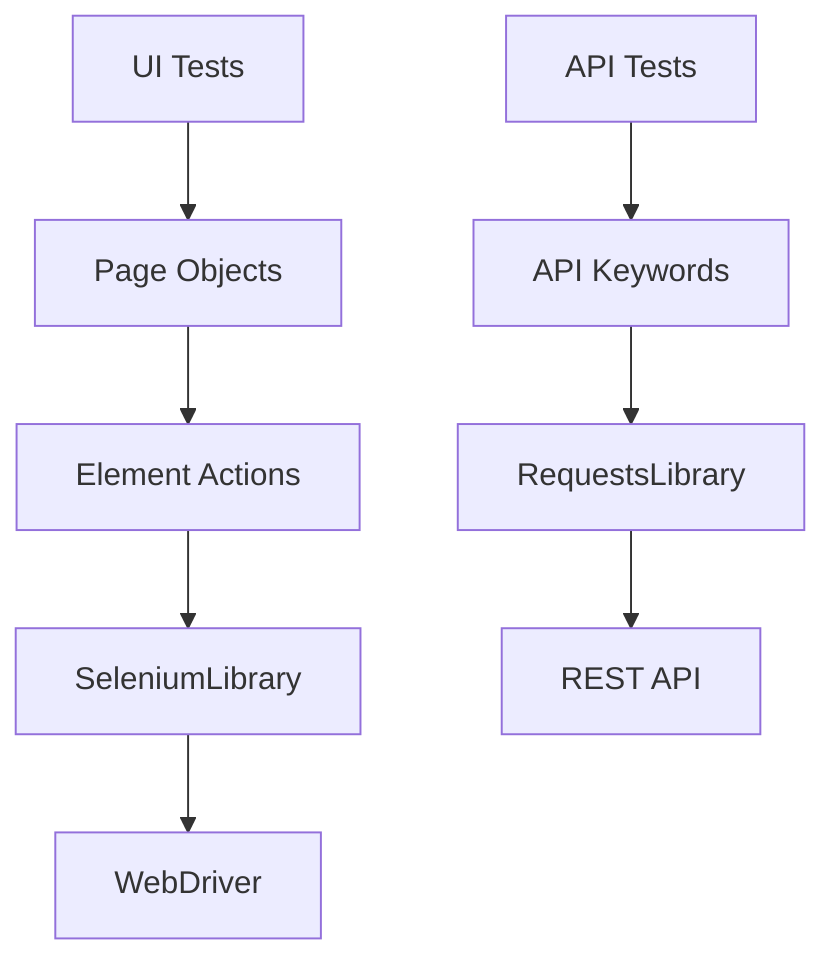
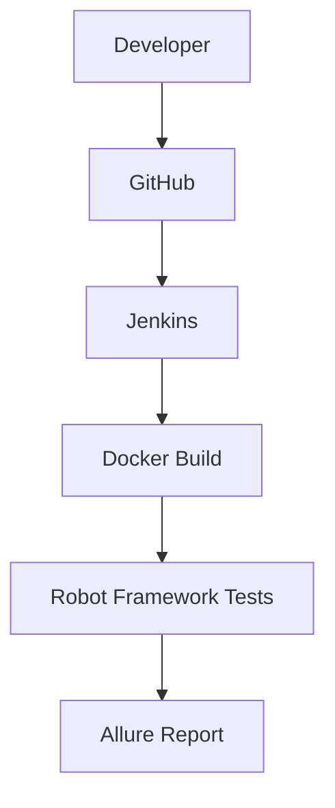

# Robot Framework Test Automation Framework


A production-style Robot Framework automation project demonstrating modern UI and API test automation with Docker, Selenium Grid, Jenkins, GitHub Actions and Allure Reporting.

The project follows the same architecture as my Python Test Automation Framework while using Robot Framework best practices.

It demonstrates:

- UI automation (Page Object Pattern)
- REST API automation
- Selenium Grid execution
- Parallel execution with Pabot
- Docker-based execution
- GitHub Actions CI
- Jenkins CI/CD
- Allure reporting

## Quick Start

```powershell
git clone https://github.com/krzysiuuus/robot-test-automation-framework.git
cd robot-test-automation-framework

python -m venv venv
venv\Scripts\activate

pip install -r requirements.txt

robot -d results page_object_pattern/tests
```

---

# Technologies

* Robot Framework
* SeleniumLibrary
* Selenium WebDriver
* Selenium Grid
* Remote WebDriver
* RequestsLibrary
* JSONLibrary
* REST API Testing
* Page Object Pattern
* Pabot
* Git
* GitHub Actions
* Allure Report
* Python
* Jenkins
* Docker Desktop
* Docker Compose
* Allure CLI

---

# Features

* Page Object Pattern architecture
* Reusable Element Actions layer
* End-to-end UI automation
* Dynamic test data
* Dynamic date generation
* Shared configuration management
* Reusable Robot Framework resources
* Externalized test data
* Centralized browser management
* Cross-browser execution (Chrome, Firefox, Edge)
* Local and Remote execution
* Selenium Grid support
* Remote WebDriver support
* REST API automation
* Parallel test execution with Pabot
* Reusable API keywords
* CRUD API operations (GET, POST, PUT, DELETE)
* JSONPath response validation
* JSON Schema validation
* Response time validation
* Headless execution
* Helper scripts for local and remote test execution
* Screenshot on failure
* Retry mechanism
* Allure Report integration
* GitHub Actions CI/CD
* Docker support
* Docker Compose support
* Jenkins Pipeline
* Dockerized Jenkins
* CI/CD Pipeline
* Allure report publishing in Jenkins
* Containerized test execution

---

# Architecture

The framework separates UI automation, API automation and CI/CD execution into independent layers.

## Framework Architecture



## CI/CD Architecture



---

# Project Structure

```text
robot-test-automation-framework/
│
├── .github/
│   └── workflows/
│
├── api_tests/
│   ├── data/
│   ├── resources/
│   └── tests/
│
├── config/
│
├── page_object_pattern/
│   ├── data/
│   ├── pages/
│   ├── resources/
│   └── tests/
├── results/
├── scripts/
│   ├── start_grid.bat
│   ├── stop_grid.bat
│   ├── run_all_browsers.bat
│   └── run_all_browsers_remote.bat
│
├── Dockerfile
├── Dockerfile.jenkins
│
├── docker-compose.yml
├── docker-compose-grid.yml
├── docker-compose-jenkins.yml
│
├── Jenkinsfile
├── requirements.txt
├── README.md
└── .gitignore
```

---

# Installation

Clone repository:

```bash
git clone https://github.com/krzysiuuus/robot-test-automation-framework.git
cd robot-test-automation-framework
```

Create virtual environment:

```bash
python -m venv venv
```

Activate virtual environment:

Windows

```bash
venv\Scripts\activate
```

Install dependencies:

```bash
pip install -r requirements.txt
```

---

# Running Tests

### Run all tests

Chrome

```bash
robot -d results -v BROWSER:Chrome page_object_pattern/tests
```

Firefox

```bash
robot -d results -v BROWSER:Firefox page_object_pattern/tests
```

Edge

```bash
robot -d results -v BROWSER:Edge page_object_pattern/tests
```

Run single test

```bash
robot -d results page_object_pattern/tests/test_flight_search.robot
```

Run tests in headless mode

```bash
robot -d results \
-v BROWSER:Chrome \
-v HEADLESS:True \
page_object_pattern/tests
```

Run tests with Allure

```bash
robot -d results \
--listener allure_robotframework \
page_object_pattern/tests
```

Run tests with Retry

```bash
robot -d results \
--listener RetryFailed:1 \
page_object_pattern/tests
```

Run with Allure and Retry

```bash
robot -d results \
--listener allure_robotframework \
--listener RetryFailed:1 \
-v BROWSER:Chrome \
page_object_pattern/tests
```

### Remote execution (Selenium Grid)

Start Selenium Grid
```bash
docker compose -f docker-compose-grid.yml up
```

Run Chrome
```bash
robot -d results \
-v EXECUTION:REMOTE \
-v BROWSER:Chrome \
page_object_pattern/tests
```
Run Firefox
```bash
robot -d results \
-v EXECUTION:REMOTE \
-v BROWSER:Firefox \
page_object_pattern/tests
```
Run Edge
```bash
robot -d results \
-v EXECUTION:REMOTE \
-v BROWSER:Edge \
page_object_pattern/tests
```
---

### Parallel execution (Pabot)

Run UI tests in parallel:

```bash
pabot --outputdir results/pabot page_object_pattern/tests
```

Run UI tests in parallel on Selenium Grid:

```bash
pabot --processes 3 --outputdir results/pabot-grid \
-v EXECUTION:REMOTE \
-v BROWSER:Chrome \
page_object_pattern/tests
```

## Helper Scripts

Start Selenium Grid:

```bash
scripts\start_grid.bat
```

Run tests on all browsers locally:

```bash
scripts\run_all_browsers.bat
```

Run tests on all browsers using Selenium Grid:

```bash
scripts\run_all_browsers_remote.bat
```

Stop Selenium Grid:

```bash
scripts\stop_grid.bat
```

## API Testing

The framework also contains API automated tests built with RequestsLibrary.

Implemented API features:

- GET requests
- POST requests
- PUT requests
- DELETE requests
- Response status validation
- JSONPath response validation
- JSON Schema validation
- Response time assertions
- Reusable API keywords

Run all API tests:

```bash
robot -d results api_tests/tests
```
Run single API test:

```bash
robot -d results api_tests/tests/test_get_single_user.robot
```

# GitHub Actions

The GitHub Actions workflow executes UI and API tests automatically for configured repository events, including pushes to the main development branch.

Pipeline stages:

- Checkout repository
- Install dependencies
- Execute API tests
- Execute UI tests
- Publish reports

# Jenkins

The project includes a Dockerized Jenkins environment and a pipeline defined as code in `Jenkinsfile`.

Pipeline stages:

1. Checkout the repository
2. Build the Robot Framework Docker image
3. Execute API tests inside Docker
4. Publish the Allure report
5. Archive Robot Framework test artifacts

Start Jenkins:

```powershell
docker compose -f docker-compose-jenkins.yml up -d --build
```

Jenkins is available at:

```text
http://localhost:8080
```

The pipeline requires:

- Pipeline plugin
- Git plugin
- Docker Pipeline plugin
- Allure Jenkins plugin
- Allure Commandline configured under Jenkins Tools

# Docker

The project supports containerized test execution with Docker and Docker Compose.

## Build the Test Image

```powershell
docker build -t robot-test-framework .
```

Verify the image:

```powershell
docker run --rm robot-test-framework --version
```

## Run API Tests in Docker

```powershell
docker run --rm `
  -v "${PWD}\results:/app/results" `
  robot-test-framework `
  -d results/api `
  api_tests/tests
```

The generated Robot Framework reports will be available in:

```text
results/api/
├── output.xml
├── log.html
└── report.html
```

## Run API Tests with Allure Results

```powershell
docker run --rm `
  -v "${PWD}\results:/app/results" `
  robot-test-framework `
  -d results/api `
  --listener allure_robotframework:results/api/allure `
  api_tests/tests
```

Allure result files will be generated in:

```text
results/api/allure/
```

## Docker Compose

Build and start the test service:

```powershell
docker compose up --build
```

Start previously built services:

```powershell
docker compose up
```

Stop and remove the containers:

```powershell
docker compose down
```

## Selenium Grid

Start Selenium Grid in the foreground:

```powershell
docker compose -f docker-compose-grid.yml up
```

Start Selenium Grid in the background:

```powershell
docker compose -f docker-compose-grid.yml up -d
```

Check the running Grid services:

```powershell
docker compose -f docker-compose-grid.yml ps
```

Open the Selenium Grid console:

```text
http://localhost:4444/ui/
```

Stop Selenium Grid:

```powershell
docker compose -f docker-compose-grid.yml down
```

## Jenkins in Docker

Build and start Jenkins:

```powershell
docker compose -f docker-compose-jenkins.yml up -d --build
```

Check the Jenkins container:

```powershell
docker compose -f docker-compose-jenkins.yml ps
```

Follow Jenkins logs:

```powershell
docker compose -f docker-compose-jenkins.yml logs -f jenkins
```

Open Jenkins:

```text
http://localhost:8080
```

Stop Jenkins:

```powershell
docker compose -f docker-compose-jenkins.yml down
```

The Jenkins home directory is stored in a named Docker volume, so Jenkins configuration and build history remain available after the container is stopped.

# Configuration 

The framework supports runtime configuration through Robot Framework variables.

Available options:

- BROWSER=Chrome
- BROWSER=Firefox
- BROWSER=Edge
- HEADLESS=True
- EXECUTION=LOCAL
- EXECUTION=REMOTE

Variables can be overridden directly from the command line:

```bash
robot -v BROWSER:Firefox -v HEADLESS:True page_object_pattern/tests
```

Example of remote execution:

```bash
robot -v EXECUTION:REMOTE -v BROWSER:Chrome page_object_pattern/tests
```

Available API configuration:

- API_BASE_URL

# Current Test Scenarios

## UI

- Flight Search
- Hotel Search
- Create Account
- Login Validation
- Update Billing Address

## API

- GET Single User
- Create Post
- Update Post
- Delete Post

---

# Planned Features

The project is being developed incrementally.

Next planned improvements:

* Browser matrix execution
* UI execution in Jenkins Pipeline
* Parallel UI/API execution

---

# Author

Created by [krzysiuuus](https://github.com/krzysiuuus)
